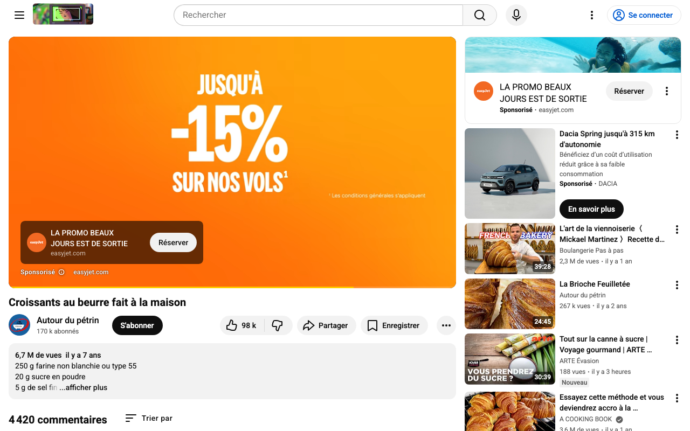
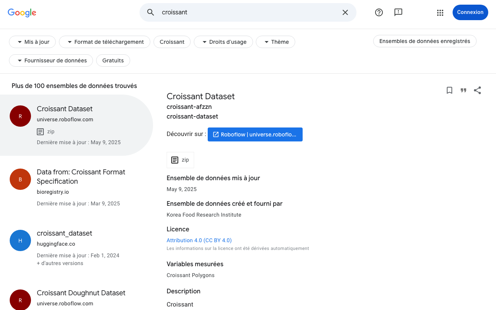
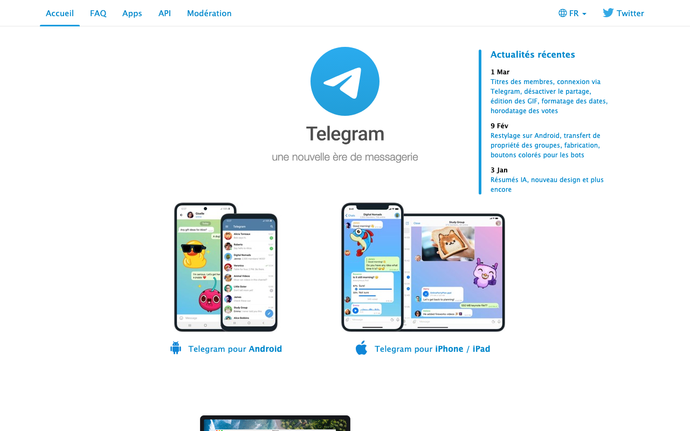
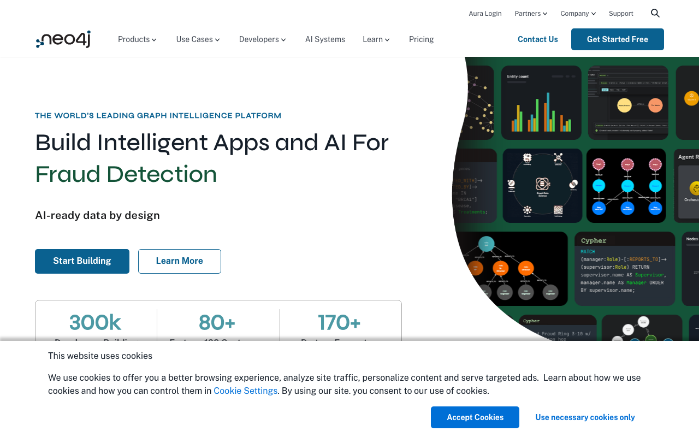
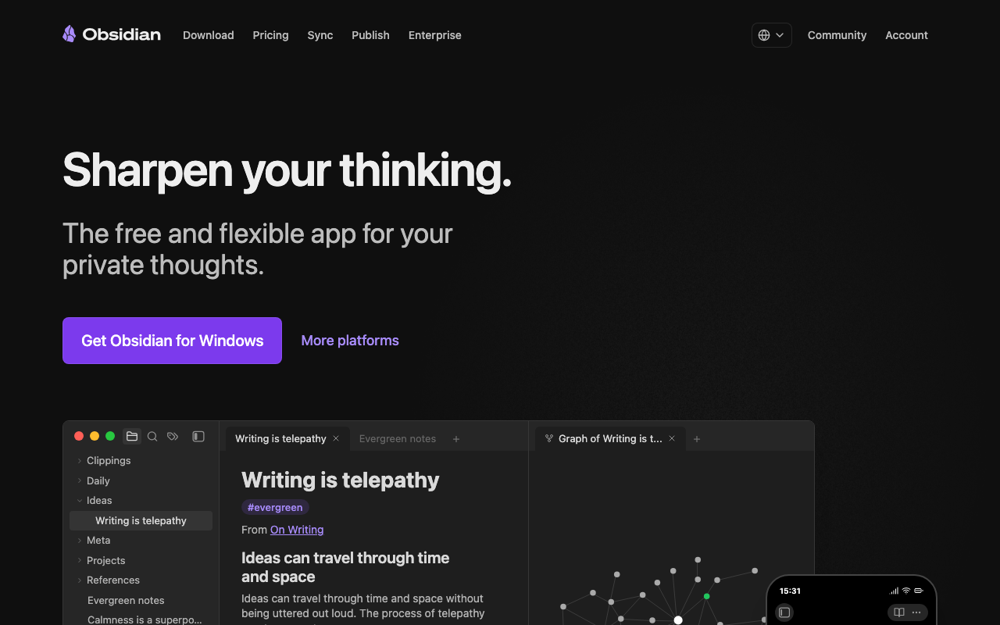
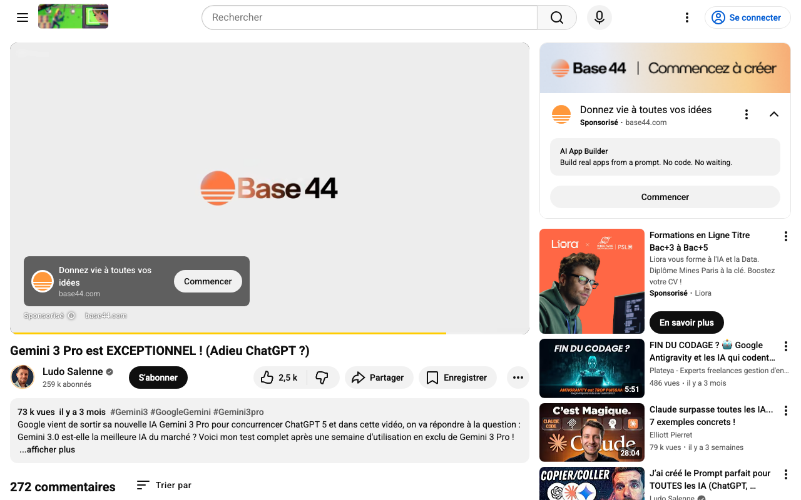
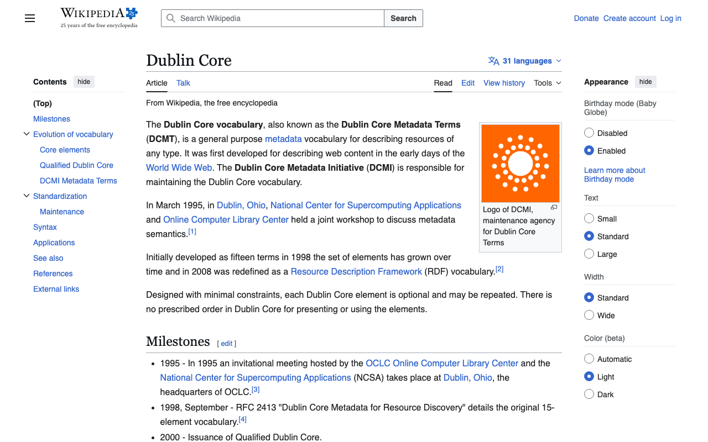

# 🧑‍🍳 Croissant Toolkit Cookbook: Multi-Skill Workflows

Welcome to the toolkit cookbook! This guide focuses on **Skill Composition**—how to chain the toolkit's intelligent agents together to solve complex data engineering and research problems.

---

## 🏗️ Core Concept: Composition over Isolation
While each skill is powerful on its own, the real power of the Croissant Toolkit lies in **orchestration**. By passing the output of one skill as the input to another, you can build autonomous pipelines.

---

## 🍲 Recipes (Use Cases)

### 1. The "Visual Video Researcher"
**Goal:** Discover relevant video content, transcribe it, extract metadata, and save a visual proof.
- **Recipe:** `YouTuber` + `Transcriber` + `Screenshot Taker` + `Croissant Expert`
- **Workflow:**
    1. Use **YouTuber** to find the most relevant videos for a topic.
    2. Use **Screenshot Taker** (via `video_snapshot.py`) to capture the video frame (automatically bypassing ads).
    3. Use **Transcriber** to get the text.
    4. Use **Croissant Expert** to bundle the URL, the snapshot path, and the transcript into a valid metadata record.



### 2. The "Intelligence Gathering & Alerting"
**Goal:** Monitor a website, perform deep internal research, and notify a team of findings.
- **Recipe:** `Navigator` + `Walker` + `NLP Expert` + `Telegram Expert` + `Communication Officer`
- **Workflow:**
    1. **Navigator** finds the primary data source URL.
    2. **Walker** explores all internal links to find deep "About" or "Legal" pages.
    3. **NLP Expert** summarizes the findings across all crawled pages.
    4. **Telegram Expert** sends a quick notification to the team.
    5. **Communication Officer** sends a comprehensive PDF/HTML report to the stakeholders' **email**.




### 3. The "Semantic Knowledge Graph"
**Goal:** Convert web data into a searchable graph database for relational discovery.
- **Recipe:** `Wizard` + `Neo4j Expert` + `Librarian`
- **Workflow:**
    1. **Wizard** orchestrates the acquisition and Croissant generation.
    2. **Neo4j Expert** ingests the resulting JSON-LD into a graph.
    3. **Librarian** performs a semantic search across the graph to find hidden connections between datasets.



### 4. The "Archivist's Workspace"
**Goal:** Build a persistent research hub in Obsidian from dynamic web content.
- **Recipe:** `Screenshot Taker` + `NLP Expert` + `Obsidian Expert`
- **Workflow:**
    1. **Screenshot Taker** captures the full-page visual record (handling consent popups).
    2. **NLP Expert** extracts entities and tags from the page content.
    3. **Obsidian Expert** creates a structured Markdown file linking the image and the extracted metadata.



### 5. The "Standardized Metadata Creator"
**Goal:** Transform raw data into industry-standard metadata formats.
- **Recipe:** `Walker` + `NLP Expert` + `Croissant Expert`
- **Workflow:**
    1. **Walker** crawls a repository to index files.
    2. **NLP Expert** extracts descriptions.
    3. **Croissant Expert** generates a standardized `.jsonld` file following the MLCommons protocol.




---

## 🧙 The Orchestrator (Wizard) 
The `Wizard` (located in `.gemini/skills/wizard/scripts/wizard.py`) is our primary tool for these combinations. It is designed to be the "glue" that triggers these skills in sequence.

### Example Sequence in Wizard:
```python
# Pseudo-code of a combined workflow
results = navigator.search("Global news")
data = walker.explore(results[0].url)
metadata = nlp.analyze(data)
croissant = creator.generate(metadata)
telegram.send_notification("New research complete!", file=croissant)
```

## 🛠️ Tips for Combining Skills
1. **JSON Interoperability**: Most skills save output to `.json` files (e.g., `youtube_search_results.json`). Use these files as hand-off points between scripts.
2. **Environment Synergy**: Ensure your `GEMINI_API_KEY` and `TELEGRAM_BOT_TOKEN` are set so skills can communicate and reason during the chain.
3. **Wait Times**: When chaining visual skills (like Screenshot Taker) with navigation skills, always use the `--wait` flag to allow dynamic content to settle.
